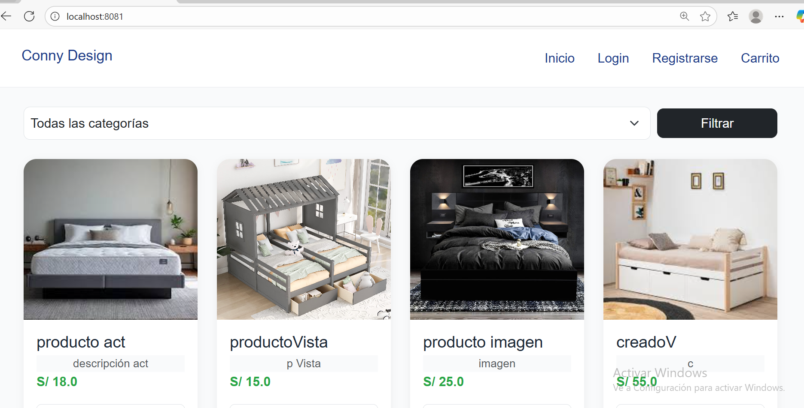
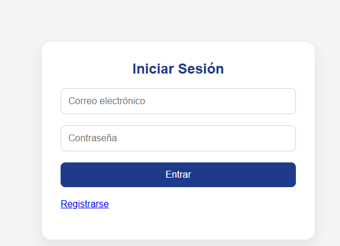
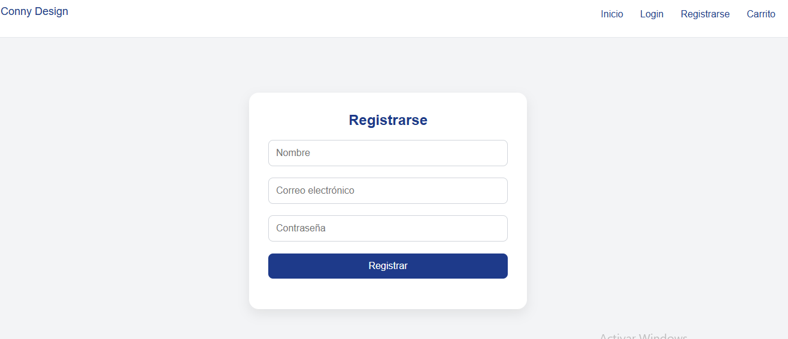
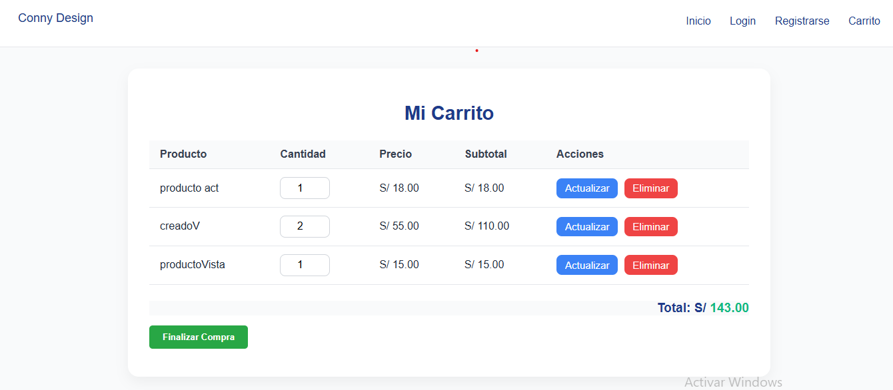
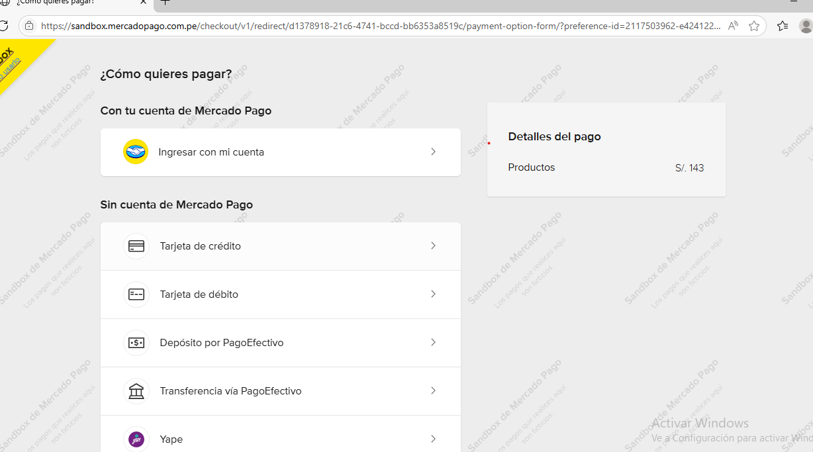
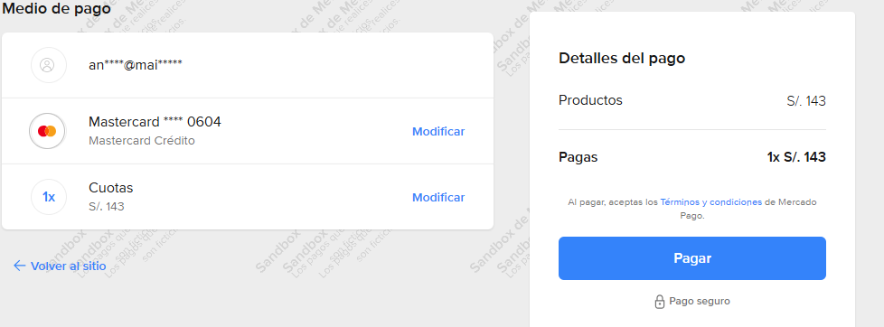
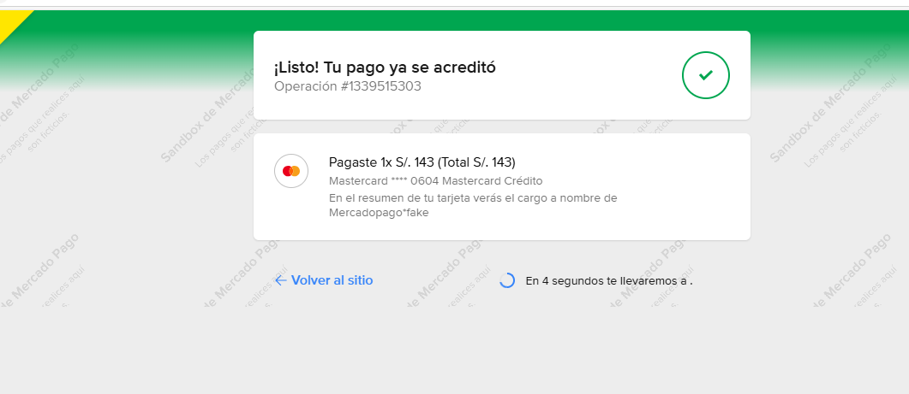
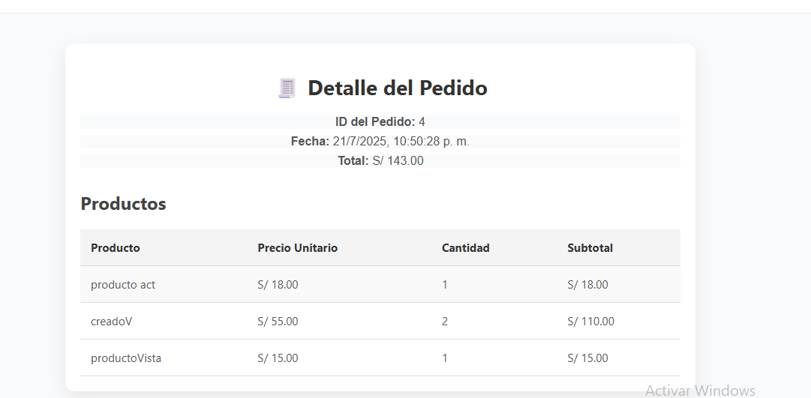

# 🛒 E-Commerce - Tienda Virtual con Spring Boot

Este proyecto es una aplicación web de e-commerce desarrollada con **Spring Boot** en el backend. Permite a los usuarios registrarse, iniciar sesión, navegar por productos, agregarlos al carrito y realizar compras. El sistema también permite a los administradores gestionar productos y pedidos.

## 🚀 Características principales

- Registro e inicio de sesión de usuarios
- Roles: Cliente y Administrador
- Gestión de productos (crear, listar, editar, eliminar)
- Carrito de compras por usuario autenticado
- Pasarela de pago integrada con **Mercado Pago**
- Registro y detalle de pedidos
- Seguridad con Spring Security
- Validaciones backend y respuesta estructurada con DTOs

## 🧪 En desarrollo

- Integración con Mercado Pago (Checkout API)
- Webhook para recibir notificaciones de pago
- Vista de historial de pedidos
- Panel administrativo completo
- Deploy en la nube (Railway o Render)

## 🛠️ Tecnologías utilizadas

- ☕ Java 17
- ⚙️ Spring Boot 3.x
- 🗃️ MySQL 8
- 🌐 Spring Security
- 🔀 JPA/Hibernate
- 📦 Maven
- 💳 [Mercado Pago API](https://www.mercadopago.com.pe/developers/panel)
- ☁️ Cloudinary (para imágenes de productos)
- 📄 Thymeleaf (en frontend provisional)

## 📁 Estructura del proyecto

```bash
ecommerce/
├── src/main/java/com/andresbn/ecommerce/
│   ├── controller/         # Controladores REST
│   ├── dto/                # Objetos de transferencia
│   ├── entity/             # Entidades JPA
│   ├── repository/         # Repositorios JPA
│   ├── service/            # Interfaces de servicio
│   ├── service/impl/       # Implementaciones de servicio
│   └── security/           # Configuración de seguridad
├── src/main/resources/
│   └── application.properties
│
└── pom.xml
```
## ⚙️ Configuración inicial

1. Clona el repositorio:
```
git clone https://github.com/AndresBN-666/ecommerce.git
```

2. Crea una base de datos en MySQL:
```
CREATE DATABASE ecommerce;
```

3.Configura application.properties:
```
spring.datasource.url=jdbc:mysql://localhost:3306/ecommerce
spring.datasource.username=root
spring.datasource.password=

mercadopago.access-token=TU_ACCESS_TOKEN
cloudinary.cloud-name=TU_CLOUD_NAME
cloudinary.api-key=TU_API_KEY
cloudinary.api-secret=TU_API_SECRET
```

4.Ejecuta la aplicación con tu IDE o con:
```
./mvnw spring-boot:run
```

## 🧠 Autor
- Andrés Bárcena Neyra

📍 Perú

🚀 Desarrollador Java backend en formación, enfocado en construir
soluciones reales con buenas prácticas y enfoque profesional.

## 🖼️ Capturas de pantalla

### 🛍️ Panel de productos


### 🔐 Formulario de inicio de sesión


### 📝 Formulario de registro


### 🛒 Carrito de compras


### 💳 Proceso de pago con Mercado Pago




### 📦 Detalle del pedido pagado
